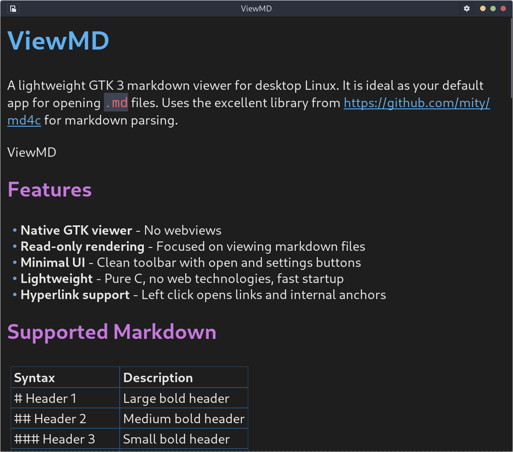

# ViewMD

A lightweight GTK 3 markdown viewer for desktop Linux. It is ideal as your default app for opening `.md` files. Uses the excellent library [md4c](https://github.com/mity/md4c) for markdown parsing. This project is sort of a companion app/fork of my other markdown project [TrayMD](https://github.com/rabfulton/TrayMD). 



## Features

- **Native GTK viewer** - No webviews
- **Read-only rendering** - Focused on viewing markdown files
- **Minimal UI** - Clean toolbar with open and settings buttons
- **Lightweight** - Pure C, no web technologies, fast startup
- **Hyperlink support** - Left click opens links and internal anchors
- **Document search** - `Ctrl+F` with next/previous match navigation

## Supported Markdown

| Syntax | Description |
|--------|-------------|
| `# Header 1` | Large bold header |
| `## Header 2` | Medium bold header |
| `### Header 3` | Small bold header |
| `**bold**` | Bold text |
| `*italic*` | Italic text |
| `` `code` `` | Inline code |
| <code>```...```</code> | Code block |
| `- item` | List item |
| `> quote` | Block quote |
| `[text](url)` | Link |
| `~~strike~~` | Strikethrough |
| `\| table \| row \|` | Markdown tables |
| `---` | Horizontal rule |

Code blocks currently support a beta version of keyword highlighting for fenced languages `c`, `java`, and `python`.

## Installation

### Arch Linux (AUR)

https://aur.archlinux.org/packages/viewmd

### Debian/Ubuntu (.deb)

Install a built `.deb` package with:

```bash
sudo apt install ./viewmd_*.deb
```

### Fedora/RHEL (.rpm)

Install a built `.rpm` package with:

```bash
sudo dnf install ./viewmd-*.rpm
```

## Usage

Run `viewmd` to start the application.

- **Open button**: Open a markdown document
- **Reload button**: Reload the currently open document from disk
- **Settings button**: Adjust theme, fonts, and markdown accent colors

### Find in Document

- Press `Ctrl+F` to open search.
- Type to highlight matches as you search.
- Press `Enter` for next match and `Shift+Enter` for previous match.
- Press `Esc` to close search.

### Set as Default `.md` Viewer

After installing, associate markdown MIME types with `viewmd.desktop`:

```bash
xdg-mime default viewmd.desktop text/markdown
xdg-mime default viewmd.desktop text/x-markdown
```

Verify the current default:

```bash
xdg-mime query default text/markdown
```

Test by opening a markdown file through your desktop association:

```bash
xdg-open README.md
```


## Building From Source

```bash
make
sudo make install
```

This installs:
- Binary to `/usr/local/bin/viewmd`
- Desktop file to `/usr/local/share/applications/viewmd.desktop`

### Uninstallation

```bash
sudo make uninstall
```
### Dependencies

### Arch Linux
```bash
sudo pacman -S gtk3
```

### Ubuntu/Debian
```bash
sudo apt install libgtk-3-dev
```

### Fedora
```bash
sudo dnf install gtk3-devel
```

## Packaging Templates

- Arch: `packaging/arch/PKGBUILD`
- Debian: `packaging/deb/control.in`
- RPM: `packaging/rpm/viewmd.spec.in`
## License

MIT License

## Other Useful Projects
- TrayMD is an app for taking notes in markdown with live editing [TrayMD](https://github.com/rabfulton/TrayMD)
- Preditor is an image viewer with a similar philosophy to viewmd [preditor](https://github.com/rabfulton/preditor)
- Try my AI panel plugin for XFCE [XFCE Ask](https://github.com/rabfulton/xfce-ask)
- For a feature complete AI application try out [ChatGTK](https://github.com/rabfulton/ChatGTK)
- A lightweight speech to text implementation [Auriscribe](https://github.com/rabfulton/Auriscribe)
- A lightweight local movie database and browser [ReelVault](https://github.com/rabfulton/ReelVault)
